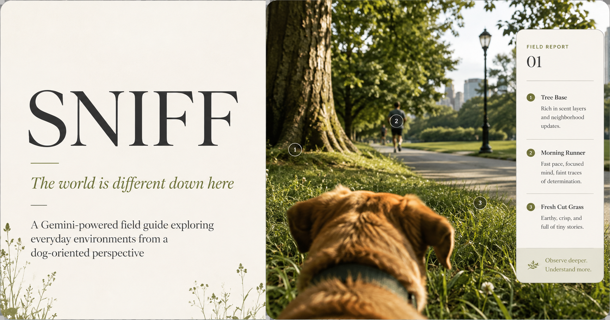

<p align="center">
  
</p>

# SNIFF

**The world is different down here.**

SNIFF is a multimodal web experience that uses Google Gemini to examine an environment from a dog-oriented exploratory perspective.

Users can upload a photograph or capture a scene with their camera. SNIFF analyzes visible features such as surfaces, vegetation, movement, people, pathways, lighting, and environmental structure, then transforms the result into an interactive field report.

The experience is designed as an editorial field guide rather than a traditional AI chatbot or dashboard.

## Overview

SNIFF explores a simple question:

**What might stand out if we looked at an everyday environment from a lower, dog-oriented perspective?**

For each analyzed scene, SNIFF generates:

- A concise scene classification and summary
- Four to six visible points of interest
- A SNIFF score for each discovery
- A grounded explanation based on visible evidence
- Model confidence
- Normalized image coordinates for interactive markers
- A safe observational **Sniff Quest**

The application does not claim to detect smells, chemical traces, ultrasonic sound, invisible scent trails, or a dog's thoughts or behavior.

## Core Experience

```text
Photo or camera capture
        ↓
Gemini multimodal analysis
        ↓
Structured JSON response
        ↓
Schema validation
        ↓
Interactive field report
        ↓
Image markers + discovery details + Sniff Quest
```

Each discovery returned by Gemini includes normalized image coordinates:

```json
{
  "label": "TREE BASE",
  "category": "exploration",
  "interestScore": 92,
  "explanation": "The rough tree base creates a distinct natural landmark with a different surface and texture from the surrounding grass.",
  "confidence": 0.95,
  "location": {
    "x": 0.32,
    "y": 0.55
  }
}
```

The frontend uses these coordinates to position numbered markers directly over the relevant areas of the photograph.

## Google Gemini Integration

SNIFF uses the Google Gemini API for multimodal scene analysis.

Gemini receives:

- The uploaded or captured image
- Grounding instructions
- A structured response schema

The model is instructed to analyze only information visibly supported by the photograph.

The response is constrained and validated before it reaches the interface.

SNIFF uses Gemini for:

- Multimodal image understanding
- Scene classification
- Discovery selection
- Relative interest scoring
- Grounded explanations
- Approximate feature coordinates
- Sniff Quest generation

API credentials remain server-side and are never intentionally exposed to the browser.

## Grounding and Responsible Design

SNIFF is intentionally conservative about what can be inferred from a photograph.

It does **not** claim to directly detect:

- Smells or scent molecules
- Chemical traces
- Invisible animal markings
- Ultrasonic sound
- A dog's thoughts, feelings, intentions, or behavior

Categories such as `smell` describe possible sensory relevance of a visible feature. They do not mean that SNIFF detected an actual smell.

The **Dog View** mode is also presented as a simplified visual approximation inspired by canine dichromatic vision. It is not intended to reproduce an individual dog's complete visual or sensory experience.

## Sample Scenes

The application includes several pre-analyzed environments so the interaction can be explored without uploading an image:

- **City Park**
- **Woodland Trail**
- **Home Kitchen**

These experiences are explicitly labeled **PRE-ANALYZED SAMPLE** in the interface and are not presented as live Gemini responses.

## Tech Stack

### Frontend

- React 19
- TypeScript
- Vite
- Tailwind CSS
- Motion
- Lucide React

### Backend

- Node.js
- Express for local production testing
- Vercel Functions for deployed API routes
- Google GenAI SDK

### AI

- Google Gemini
- Multimodal image input
- Structured JSON output
- Schema-based response validation

### Browser APIs

- MediaDevices / `getUserMedia`
- Canvas
- FileReader
- Web Audio API

## Project Structure

```text
sniff/
├── api/
│   ├── health.ts
│   └── sniff.ts
│
├── src/
│   ├── components/
│   ├── data/
│   ├── server/
│   │   └── geminiService.ts
│   ├── types/
│   ├── utils/
│   ├── App.tsx
│   ├── index.css
│   └── main.tsx
│
├── server.ts
├── index.html
├── package.json
├── tsconfig.json
├── vite.config.ts
├── .env.example
└── README.md
```

## Deployment Architecture

SNIFF uses two backend entry points depending on the environment:

- `server.ts` provides the Express server used for local production testing.
- `api/health.ts` and `api/sniff.ts` are deployed as Vercel Functions.

Both paths reuse the same Gemini analysis logic from `src/server/geminiService.ts`, keeping model configuration and response validation centralized.

## Running Locally

### Prerequisites

- Node.js
- npm
- A Google Gemini API key with access to a supported Gemini model

### 1. Clone the repository

```bash
git clone <repository-url>
cd sniff
```

### 2. Install dependencies

```bash
npm install
```

### 3. Configure environment variables

Create a local environment file from the example:

```bash
cp .env.example .env
```

Then configure:

```env
GEMINI_API_KEY=your_gemini_api_key
APP_URL=http://localhost:3000
```

Never commit your real `.env` file or API key.

### 4. Start development

```bash
npm run dev
```

Open:

```text
http://localhost:3000
```

### 5. Validate the project

```bash
npm run lint
```

### 6. Build for production

```bash
npm run build
```

### 7. Run the production server

```bash
NODE_ENV=production npm start
```

The API health endpoint is available at:

```text
http://localhost:3000/api/health
```

## API Endpoint

### `POST /api/sniff`

Analyzes an image using Gemini.

Example request body:

```json
{
  "imageBase64": "data:image/jpeg;base64,..."
}
```

The server validates the Gemini response before returning it to the frontend.

If Gemini or the provider is unavailable, the application returns a controlled service-level error rather than exposing raw provider responses, credentials, stack traces, or project details.

## Supported Image Formats

SNIFF currently accepts:

- JPEG
- PNG
- WebP

Maximum upload size:

```text
15 MB
```

Camera captures are resized when necessary before analysis to avoid unnecessarily large payloads.

## Design Direction

SNIFF follows an editorial field-guide visual system built around:

- Warm neutral surfaces
- High-contrast typography
- Restrained earthy accents
- Large photography
- Sparse interface chrome
- Numbered observational markers
- Minimal motion
- Clear visual hierarchy

The interface intentionally avoids generic AI dashboard patterns, excessive gradients, glassmorphism, and chatbot-style interaction.

## Reliability

The application includes safeguards for:

- Invalid Gemini responses
- Unsupported image formats
- Oversized images
- Stale analysis state
- Concurrent analysis requests
- Camera permission failures
- Network or provider failures
- Invalid discovery coordinates
- Raw API error exposure

If a newer image is submitted while an earlier request is still running, the older request cannot overwrite the newer result.

## Privacy

Uploaded images are sent to the configured Gemini API only for scene analysis.

SNIFF does not include a database or user-account system and does not intentionally persist uploaded images within the application.

API keys are configured through server-side environment variables and must not be committed to source control.

## Challenge

SNIFF was developed for the **DEV Weekend Challenge: Dog Days Edition**, with Google AI used as the primary prize technology.

The project focuses on making Gemini integral to the interaction rather than adding AI as a secondary chatbot feature.

## Status

SNIFF is an experimental project and should not be interpreted as a scientific model of canine perception or behavior.

Live Gemini analysis requires a Google Cloud project with valid Gemini API access and available quota.

## Author

**Sushyam Nagallapati**

Built with React, TypeScript, Google Gemini and ☕️
